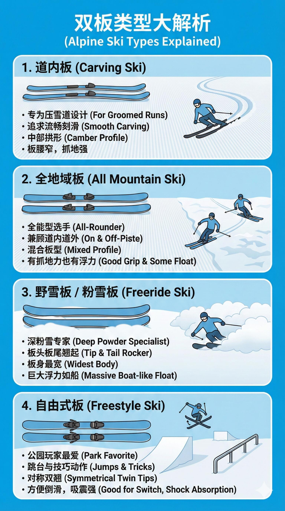
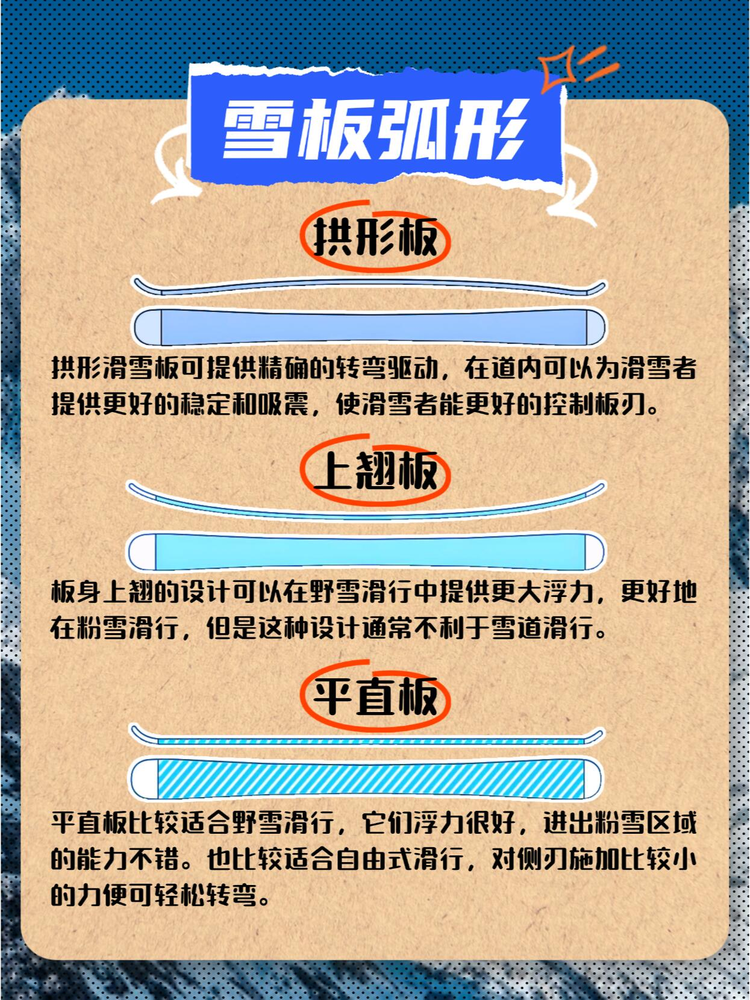

# 双板雪板

## 种类

### 道内板/卡宾板

板头翘起，板腰相对窄细，板尾趋向平直。小回转半径更灵活适合初学者；大回转半径更稳定适合进阶者。

### 全山板

较常见的雪板类型，适用大多数的滑雪风格，中等的硬度、宽度、长度，可以支持多种滑雪风格，也有很好的操控性。

### 野雪板/大山板

板腰、板头和板尾都比其他雪板更宽，雪越深的地方越需要又宽又长的雪板，有较大的侧刃半径，可以比较轻松的弯曲、回转。

### 自由式板

板头和板尾全都翘起，方便各种正滑和倒滑技巧。固定器绝对居中对称的雪板，适合在公园里施展各种技巧。固定器偏向于板尾且板尾略窄，也很好的兼顾了滑行需求。

## 长度

雪板长度直接影响舒适感和控制力：

- 短板更加灵活
- 长板更加稳定

雪板长度根据审稿测量眼睛高度作为基准，流传最广的公式是：

- 雪板长度=身高-(10~15cm)

根据以下因素可以在基准长度上适当增减：

- 自身体重：偏轻-2cm，偏重+2cm
- 滑行风格：小弯-2cm，大弯+2cm
- 滑行水平：初级-2cm，高级+2cm
- 板身形状：拱形-2cm，上翘+2cm

## 板身形状

### 拱形板

在道内可以为滑雪者提供更好的稳定和吸震，使滑雪者能更好的控制板刃。

### 上翘板

可以在野雪滑行中提供更大浮力，更好地在粉雪滑行，但是这种设计通常不利于雪道滑行。

### 平直板

比较适合野雪滑行，也比较适合自由式滑行，对侧刃施加比较小的力便可轻松转弯。

## 板头形状

### 尖头板

板头呈尖锥形，减小风阻，精准入弯，常见用于竞速的高速卡宾板。

### 圆头板

板头更宽更圆，提供更大浮力，入弯更柔和，常见于全山板、野雪板。

### 方头板

板头前端比较“平”，看起来像被削平了一点。在不增加长度的情况下增加接触面积，降低重量（去掉无效长度），常见于野雪板。

