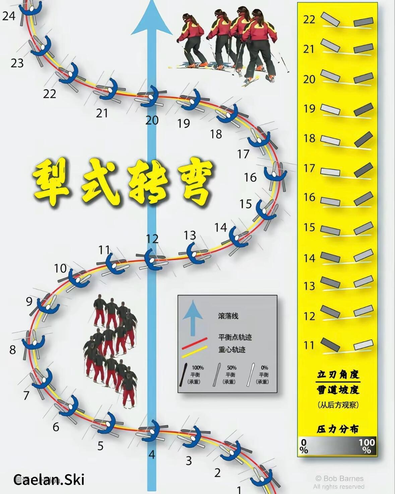
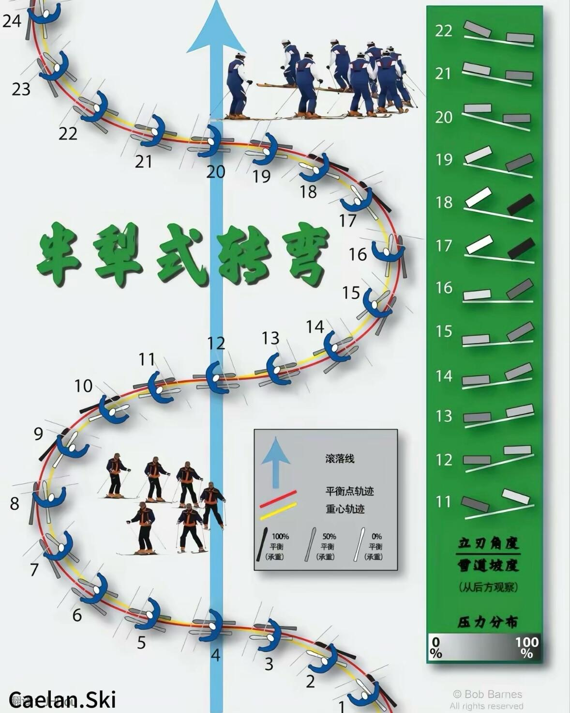
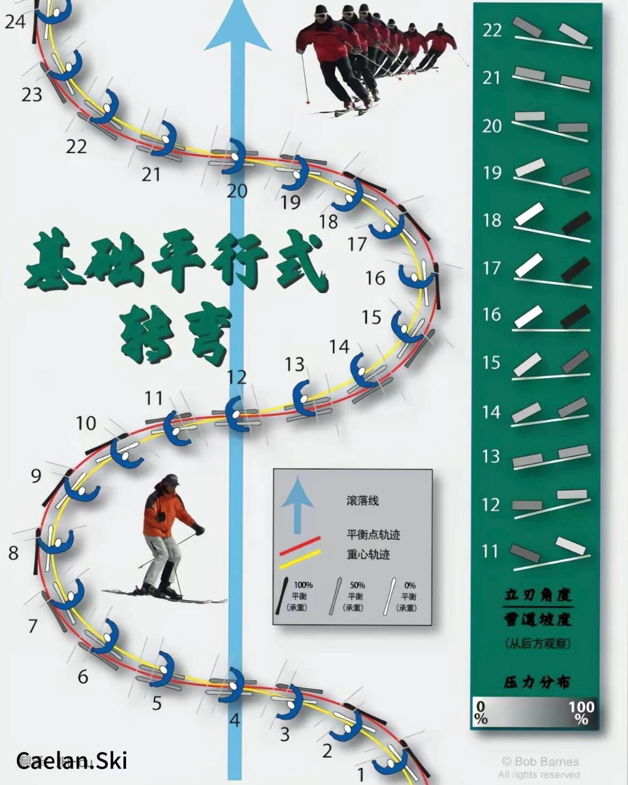
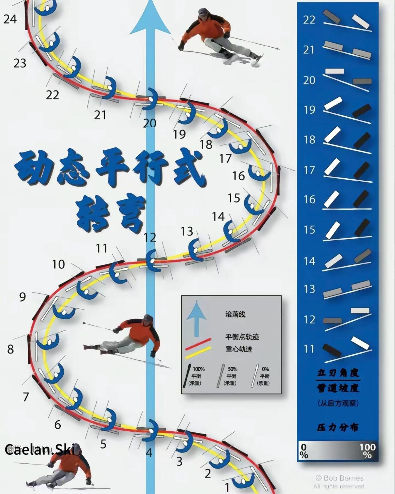

# 双板技术

## 直线滑行(Straight)

### 直滑降(Straight Down)

### 横滑降(Sliding Sideways)

## 曲线滑行(Curve)

### 小回转(Small Turn)

### 大回转(Large Turn)

## 犁式技术(Snowplough)

### 犁式滑行(Snowplough Skiing)

### 犁式刹车(Snowplough Brake)

### 犁式转弯(Snowplough Turn)

## 平行式技术(Parallel)

### 平行式滑行(Parallel Skiing)

### 平行式刹车(Parallel Brake)

### 平行式转弯(Parallel Turn)

## 搓雪(Skidding)

### 搓雪大弯(Skidding Large-Turn)

### 搓雪小弯(Skidding Small-Turn)

## 卡宾(Carving)

### 卡宾大弯(Carving Large-Turn)

### 卡宾小弯(Carving Small-Turn)

## 平地行进

### 八字登坡

### 一字登坡